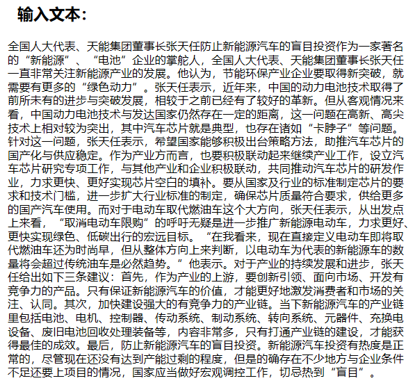
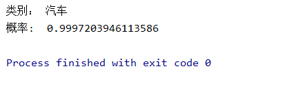

# News_Classification

[](https://pytorch.org/) [](https://www.python.org/)

#### 介绍
#### 新闻资讯文本分类

基于pytorch实现的 TextCNN 模型，模型已训练好，可直接使用


#### 环境

python 3.7

pytorch 1.8.1

jieba 0.42.1

gensim 4.0.1

pycharm 2019.2


#### 数据集

分类包括：娱乐, 财经, 房地产, 旅游, 科技, 体育, 健康, 教育, 汽车, 新闻, 文化, 女人共12类

我所使用的是搜狐新闻语料集，训练集有24000条新闻，测试集则有12000条。

各分类数量均匀，无明显差异

src/data/data.7z 解压即可得到我的原始数据


#### 数据预处理

1.将原始新闻文本文件按行打乱

2.使用jieba对所有新闻正文内容进行分词，得到词库(每一行一个词的文本文件)

3.使用word2vec训练词库生成词向量模型

4.将原始新闻文本进行分词后，替换为词向量模型中的索引

分类,正文 -----> (分类id, [2,3,4,..词索引])

每100条(id,[..])组成一个[(),(),...],然后保存为sample.pth


#### TextCNN模型示意图


#### 测试结果

对12000条新闻测试集进行测试

最终平均准确率为 **87.058%**

每个分类的错误数：

娱乐: 84	  财经: 216	房地产: 148	旅游: 96

科技: 120    体育: 22      健康: 128        教育: 83

汽车: 65      新闻: 264    文化: 238        女人: 89






#### 使用说明

安装好所需运行环境，拉取项目后

先将 src/model_save/model.7z 解压在当前文件夹中,这是训练好的模型

同样解压 src/data/word_vector/word_vector.7z，词向量数据

```shell
$ git clone https://gitee.com/worldcreator/News_Classification.git

$ cd News_Classification

$ python main.py
```

将所需要分类的新闻正文文本复制到content.txt中, 执行main.py查看输出

#### 参考论文

[1] Convolutional Neural Networks for Sentence Classification